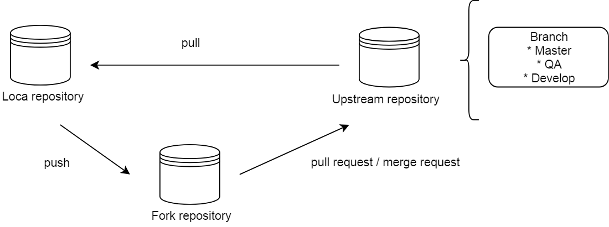

# Centraal Academy - Web Mobile Specialist (NOTES)

# GIT
Es una herramienta que facilita el versionamiento dentro del ciclo de vida del desarrollo de software.
Sin bien GIT gestiona los repositorios de codigo, necesita una gestion o administracion segura.
Para llevar acabo esto y minimizar impactos en los repositorios de trabajo y desarrollo se proponen patrones sobre como trabajar con el workflow de git. Ejemplo



  - Local repository: Representa el repositorio local de desarrollo
  - Fork repository: Es un repositorio remoto creado apartir de el repositorio estable Upstream
  - Upstream: Representa el repositorio remoto estable y protegido donde se mantiene todo el codigo estable.

Para trabajar con este patron se definen las siguientes reglas:
  1. En el repositorio local debe ejecutar "pull" de el branch Master de Upstream
  2. Si se realiza enviara algun commit de cambios evitar usar "git add ."
  3. Trabajar siempre en el repositorio local
  4. Realizar commit con "git commit -m 'descripcion de commit'"
  5. Realizar pull del repositorio Upstream del branch master
  6. Si no surgen conflictos
  6.1 Si no existen conflictos enviar los cambios a Fork en branch develop con "git push origin develop" 
  6.2 Enviar pull request desde fork a upstream
  7. Resolver conflictos

### Versionamiento de aplicaciones
Con Git se puede realizar versionamiento de la aplicacion con la ayuda de la etiqueta tag

```sh
$ git tag -a "version"
```

El versionamiento sigue un orden definido como X.Y.Z donde:
   - X: Cambios de alto impacto, no retroactivos
   - Y: Cambios de impacto medio
   - Z: Cambios menores

### CHANGELOG
Este archivo representa el historial de cambios que se han generado a lo largo de la vida del desarrollo de software donde se describe la funcionalidad liberada en cada version.
